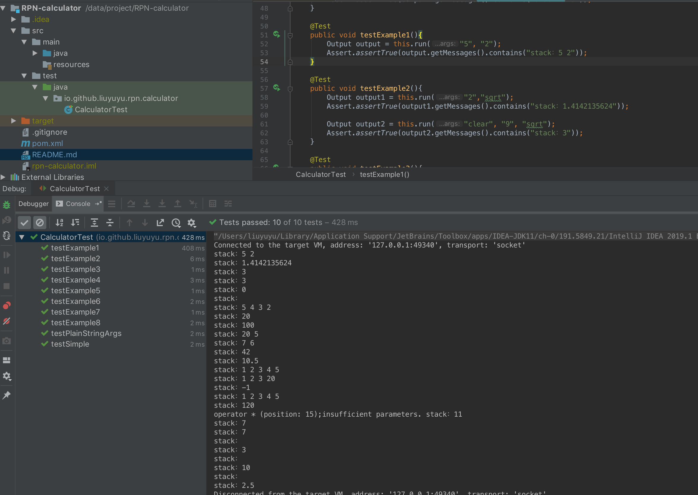

# RPN 计算器

这是一道面试题的答案，面试题原文不便贴出来，效果可以参考下面的地址和[单元测试](./src/test/java/io/github/liuyuyu/rpn/calculator/CalculatorTest.java)

地址：http://www.alcula.com/calculators/rpn/

### 运行环境
```
最低jdk 8,建议使用jdk 11或者注释掉使用BigDecimal#sqrt()的代码
```

### 单元测试

直接运行可见效果
```
io.github.liuyuyu.rpn.calculator.CalculatorTest
```

预览图
